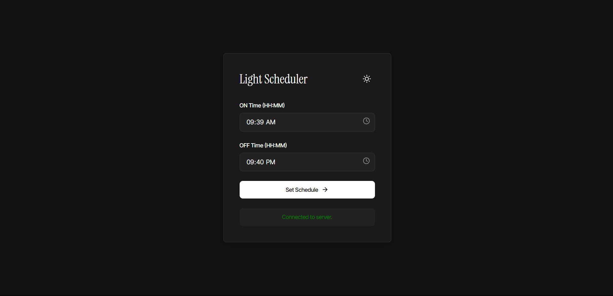
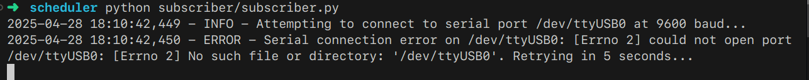

# Web-Based Light Scheduler (WebSocket + MQTT + Arduino)

This project implements a web interface to schedule turning a light ON and OFF, controlled via an Arduino and a relay module.
The architecture uses WebSockets for communication between the frontend and a backend server, and MQTT for communication between the backend server and a subscriber script that directly controls the Arduino.

## Project Structure

```
.
├── arduino/            # Arduino sketch
│   └── main.ino
├── backend/            # WebSocket server (Python)
│   └── server.py
├── frontend/           # Web interface (HTML, CSS, JS)
│   ├── index.html
│   ├── script.js
│   └── style.css
├── subscriber/         # MQTT subscriber and Arduino controller (Python)
│   └── subscriber.py
├── requirements.txt    # Python dependencies
└── README.md           # This file
```

## Components

1.  **Frontend (`frontend/`)**: A simple web page allowing users to input ON and OFF times (HH:MM format) and submit the schedule. It communicates with the backend via WebSockets.
2.  **WebSocket Backend (`backend/server.py`)**: A Python server using `websockets` and `paho-mqtt`. It listens for WebSocket connections, receives schedule updates from the frontend, validates them, and publishes the schedule as a JSON payload to the MQTT topic `relay/set_schedule`.
3.  **MQTT Subscriber (`subscriber/subscriber.py`)**: A Python script using `paho-mqtt` and `pyserial`. It connects to the MQTT broker, subscribes to `relay/set_schedule`, and stores the latest schedule received. It periodically checks the current time against the schedule and sends the appropriate command (`1` for ON, `0` for OFF) to the Arduino via the configured serial port.
4.  **Arduino (`arduino/main.ino`)**: The Arduino sketch listens for incoming serial commands (`1` or `0`) and controls a digital pin (default: 7) connected to the relay module (LOW for ON, HIGH for OFF, as per the assignment description).


## Screenshots 
### Frontend Interface


### Backend Server Log Example


### Subscriber Log Example


## Setup

1.  **Hardware:**
    *   Arduino UNO (or compatible)
    *   Relay Module (controlled by LOW signal)
    *   Light bulb and socket
    *   Wiring (ensure safe handling of mains voltage)
    *   USB cable for Arduino
    *   Computer to run the backend, subscriber, and host the frontend.
    *   (Optional but recommended) A separate MQTT broker (like Mosquitto) if you don't want to use the public one specified.

2.  **Software Dependencies:**
    *   **Python 3:** Ensure Python 3 is installed.
    *   **Python Libraries:** Install required libraries:
        ```bash
        pip install -r requirements.txt
        ```
    *   **Arduino IDE:** Needed to upload the sketch to the Arduino board.
    *   **MQTT Broker:** An MQTT broker must be accessible. The code defaults to `157.173.101.159:1883` as specified in the assignment. You can run your own Mosquitto broker locally or use a different public one by setting environment variables.

3.  **Arduino Setup:**
    *   Connect the relay module control pin to Arduino digital pin 7 (or change `relayPin` in `arduino/main.ino`).
    *   Connect the relay COM and NO terminals in series with your light bulb circuit (ensure mains power is OFF when wiring!).
    *   Connect the Arduino to your computer via USB.
    *   Open `arduino/main.ino` in the Arduino IDE.
    *   Select the correct board and port.
    *   Upload the sketch to the Arduino.
    *   Note the serial port name assigned to the Arduino (e.g., `/dev/ttyUSB0` on Linux, `COM3` on Windows).

4.  **Configuration (Environment Variables):**
    The Python scripts can be configured using environment variables (defaults are shown):
    *   `backend/server.py`:
        *   `WEBSOCKET_HOST`: Host for WebSocket server (`0.0.0.0`)
        *   `WEBSOCKET_PORT`: Port for WebSocket server (`8765`)
        *   `MQTT_BROKER_HOST`: MQTT broker address (`157.173.101.159`)
        *   `MQTT_BROKER_PORT`: MQTT broker port (`1883`)
        *   `MQTT_SCHEDULE_TOPIC`: MQTT topic for publishing schedules (`relay/set_schedule`)
    *   `subscriber/subscriber.py`:
        *   `SERIAL_PORT`: Serial port of the Arduino (`/dev/ttyUSB0`)
        *   `BAUD_RATE`: Serial baud rate (`9600`)
        *   `MQTT_BROKER_HOST`: MQTT broker address (`157.173.101.159`)
        *   `MQTT_BROKER_PORT`: MQTT broker port (`1883`)
        *   `MQTT_SCHEDULE_TOPIC`: MQTT topic for receiving schedules (`relay/set_schedule`)

    You can set these before running the scripts, e.g.:
    ```bash
    export SERIAL_PORT=/dev/ttyACM0
    export MQTT_BROKER_HOST=localhost
    ```

## Running the System

1.  **Start the MQTT Subscriber:**
    Open a terminal, navigate to the project directory, and run:
    ```bash
    # Optional: Set environment variables if defaults are not suitable
    # export SERIAL_PORT=/dev/ttyACM0
    # export MQTT_BROKER_HOST=your_broker_ip
    python subscriber/subscriber.py
    ```
    Keep this script running. It will attempt to connect to the serial port and MQTT broker.

2.  **Start the WebSocket Backend Server:**
    Open another terminal, navigate to the project directory, and run:
    ```bash
    # Optional: Set environment variables if defaults are not suitable
    # export MQTT_BROKER_HOST=your_broker_ip
    python backend/server.py
    ```
    Keep this server running.

3.  **Open the Frontend:**
    Open the `frontend/index.html` file in your web browser. It should connect to the WebSocket server (`ws://localhost:8765` by default).

4.  **Set Schedule:**
    *   Use the time inputs to select the desired ON and OFF times.
    *   Click "Set Schedule".
    *   The frontend will send the schedule to the backend server via WebSocket.
    *   The backend server will publish the schedule to the MQTT topic.
    *   The subscriber script will receive the schedule via MQTT, store it, and start checking the time.
    *   When the current time matches the ON or OFF time, the subscriber will send `1` or `0` respectively to the Arduino via the serial port, controlling the relay and the light.

## Notes

*   **Error Handling:** Basic error handling and reconnection logic are included for both WebSocket and Serial connections.
*   **MQTT Broker:** Using a public MQTT broker like the one specified might have latency or reliability issues. Running a local Mosquitto broker is recommended for development and testing.
*   **Security:** This implementation has no security features (no authentication/authorization for WebSockets or MQTT). It's suitable for a local network or educational purposes only.
*   **Time Synchronization:** Assumes the machine running the `subscriber.py` script has its clock reasonably synchronized.


