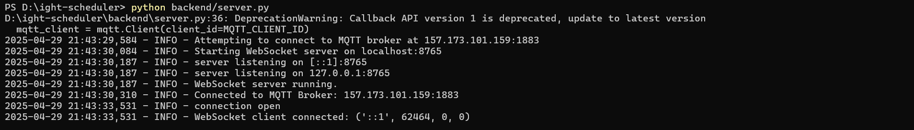
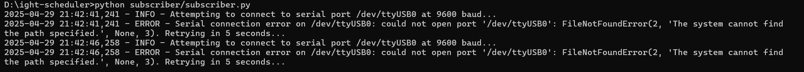

# Web-Controlled Light Scheduler (WebSocket + MQTT + Arduino)

This project provides a web-based interface to schedule when a light should turn ON and OFF. It's powered by an Arduino and relay setup, using WebSockets for real-time communication with the frontend, and MQTT to relay messages between the backend and a subscriber script that controls the Arduino.

## Project Layout

```
.
├── arduino/            # Arduino sketch
│   └── main.ino
├── backend/            # WebSocket server (Python)
│   └── server.py
├── frontend/           # User interface (HTML, CSS, JS)
│   ├── index.html
│   ├── script.js
│   └── style.css
├── subscriber/         # MQTT subscriber and serial controller (Python)
│   └── subscriber.py
├── requirements.txt    # Python library requirements
└── README.md           # This document
```

## Components Overview

1.  **Frontend (`frontend/`)**: A simple webpage where users can input desired ON/OFF times (in HH:MM format). It communicates with the backend using WebSockets.
2.  **Backend Server (`backend/server.py`)**: A Python WebSocket server using `websockets` and `paho-mqtt` libraries. It receives scheduling info from the frontend, validates it, and publishes it to the MQTT topic `relay/set_schedule`.
3.  **MQTT Subscriber (`subscriber/subscriber.py`)**: A Python script that connects to the MQTT broker, listens for messages on `relay/set_schedule`, and sends commands to the Arduino through the serial port based on the schedule.
4.  **Arduino Sketch (`arduino/main.ino`)**: Listens for serial commands (`1` to turn ON, `0` to turn OFF) and controls the relay connected to digital pin 7. LOW signal activates the relay.

## Interface Screenshots

### Web Interface


### Backend Logs


### Subscriber Logs


## Getting Started

### Hardware Needed
- Arduino UNO (or compatible)
- Relay module (triggered by LOW)
- Light bulb and socket
- Appropriate wiring (caution: mains voltage!)
- USB cable for Arduino
- Computer to host the backend, subscriber, and frontend
- (Optional) Local MQTT broker like Mosquitto, instead of the provided public broker

### Software Prerequisites
- **Python 3**
- **Required Python Packages**:
  ```bash
  pip install -r requirements.txt
  ```
- **Arduino IDE** to upload the Arduino sketch
- **MQTT Broker**: Default is `157.173.101.159:1883`. You can run your own or switch to a different one using environment variables.

### Arduino Setup
- Connect the relay module to digital pin 7 on the Arduino.
- Wire the light bulb through the relay (COM and NO terminals).
- Upload `main.ino` to the Arduino using the IDE.
- Note your Arduino's serial port (like `/dev/ttyUSB0` or `COM3`).

### Configuring Environment Variables

You can customize the setup by defining environment variables:

#### For `backend/server.py`:
- `WEBSOCKET_HOST` (default: `0.0.0.0`)
- `WEBSOCKET_PORT` (default: `8765`)
- `MQTT_BROKER_HOST` (default: `157.173.101.159`)
- `MQTT_BROKER_PORT` (default: `1883`)
- `MQTT_SCHEDULE_TOPIC` (default: `relay/set_schedule`)

#### For `subscriber/subscriber.py`:
- `SERIAL_PORT` (e.g., `/dev/ttyUSB0` or `COM3`)
- `BAUD_RATE` (default: `9600`)
- `MQTT_BROKER_HOST` (default: `157.173.101.159`)
- `MQTT_BROKER_PORT` (default: `1883`)
- `MQTT_SCHEDULE_TOPIC` (default: `relay/set_schedule`)

Example:
```bash
export SERIAL_PORT=/dev/ttyACM0
export MQTT_BROKER_HOST=localhost
```

## How to Run

### 1. Start the MQTT Subscriber
```bash
# Optional: export custom variables
python subscriber/subscriber.py
```
Keep this terminal open. It listens for schedules and controls the Arduino.

### 2. Launch the WebSocket Backend
```bash
# Optional: export custom variables
python backend/server.py
```
Keep this running to handle frontend communications and publish to MQTT.

### 3. Open the Frontend
Open `frontend/index.html` in any modern web browser. It will connect to `ws://localhost:8765` by default.

### 4. Schedule the Light
- Set ON and OFF times on the web interface
- Hit "Set Schedule"
- The backend receives the data and publishes it to MQTT
- The subscriber gets the schedule and starts monitoring time
- When the current time matches the schedule, a serial command (`1` or `0`) is sent to the Arduino, controlling the relay

## Important Notes

- **Error Recovery**: Scripts include basic reconnection and error handling.
- **Broker Choice**: Public MQTT brokers might be unreliable. A local Mosquitto instance is better for dev/testing.
- **Security Warning**: This system has no security features. Only use it in safe, local environments.
- **Clock Sync**: Make sure the system running `subscriber.py` has the correct time.

---

This setup offers a simple but solid example of integrating frontend scheduling, WebSocket and MQTT communication, and Arduino-based relay control in a full-stack hardware-software project.